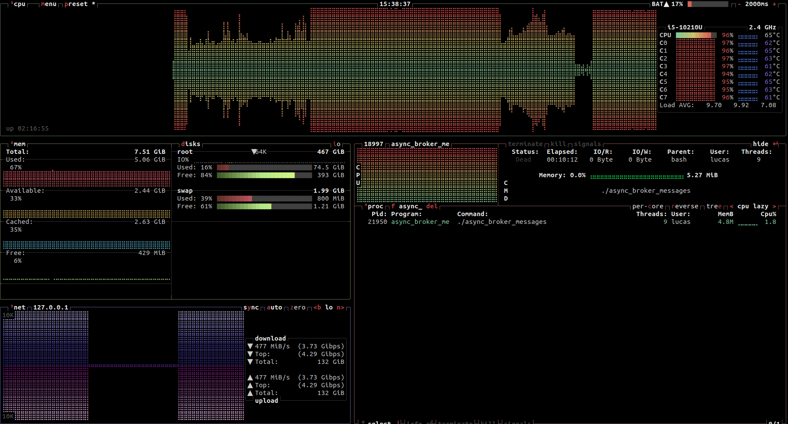

# RekT_Protocol

> **Author** : *Guichard Lucas, Mora Hugo, Ponal Mathieu* 
> **Teacher** : *Plantevin Valère* 
> **Learning**: 8INF206 - Project 
> **University**: University of Quebec at Chicoutimi
---
## Purpose

The RekT protocol (Rapid Knot Transfer) was developed as part of the project course in the winter session of 2023. The
overall project involved creating a simulation of several hundred players on a single game map using the Unreal Engine.
The course was taken by a group of 8 students who wanted to deepen their knowledge in online multiplayer game
development. The course followed a "research" format, which means we were left to deal with our difficulties and learn
to better understand new technologies and concepts independently. Nevertheless, we had a weekly progress report to
ensure that the project was moving forward smoothly. 
The team was divided into two groups. The first group (5 people) was responsible for understanding the workings of ECS (
Entity Component System) in order to manage actions (movement, color changes, etc.) of all players on the client side.
They also had to override the replication of Unreal Engine 5 to support the protocol developed by the second group.
Speaking of the second group, consisting of three people, they were in charge of writing and coding a broker with a
pub/sub protocol to support as many connections as possible with minimal consumption. This repo is containing the work
of the second group.
---
## Folders

    .
    ├── ...
    ├── GYM                     # Training zone, we were discovering the Rust programming language
    │    └── Proto_Broker            # Synchrone broker that can handle a complete connection cycle.
    ├── Async_broker            # Second version of the broker with tokio (async). Still too slow for us ;)
    │    └── ...
    ├── Async_broker_message    # Third version of the broker with tokio (async) and the message pattern. 
         └── ...                
---
## How the async broker message work ?

For better understanding of the following paragraph, check the RFC
of [our custom pub/sub protocol here](https://docs.google.com/document/d/14CvwkXtRae_5xV28Figp6gdxwyYd5Fqvls8pvmseKAI/edit?usp=sharing)

In the following schema, each line represent asynchronous task that run in the broker program.

    . # start of the broker
    ├ Main task ─┬─..                                                  
                 ├─── Ping sender  ──────────────────────────────────────────────────────────...
                 ├─── Data handler ─┬────────────────────────────────────────────────────────...                   
                     #new client => ├┬─ Client Manager n°X ──────────...────────┤ <= #disconection
                                     ├─── Heartbeat checker n°X ─────...────────┤

**Main task :** The main task initializes the configuration of the broker as well as its static variables. Once
everything is properly initialized, it launches two asynchronous tasks: the **Ping sender** and the **Data handler**. 
**Ping sender :** The ping sender is an asynchronous task that periodically sends PING requests to all connected users
of the broker. 
**Data handler :** The data handler is the main asynchronous task of the broker. It receives datagrams and decides what
needs to be done with them. For example, when a new client connects, it creates the corresponding client manager. It
also redirects datagrams between different client managers when necessary. Additionally, it includes security measures
to determine if a datagram appears to be fraudulent or not. 
**Client manager :** The client manager is an individual task launched for each client connected to the broker. It acts
as a sub-chef that handles datagrams only from its associated client. Once launched, the task immediately starts a
personal Heartbeat checker. When the client disconnects, the manager and its heartbeat checker are
destroyed. 
**Heartbeat_checker :** The heartbeat checker is an individual task lunched by a client's manager. It ensures the
connection remains alive by monitoring signs of activity such as sending and receiving requests,
as well as handling HEARTBEAT requests
---
## Results

At the end of the course, the broker was able to handle a throughput of 5Gb/sec while supporting errors and internal
logging. This project was a success as more than 300 players could connect simultaneously to the server without the
broker's memory consumption exceeding 10MB of RAM.

The key to the success of this broker lies in the use of the **Tokio library**, which allows for more efficient
asynchronous
task handling compared to threads, as it bypasses the operating system. We also utilized the **message pattern**
implemented
by Rust to optimize the number of concurrent asynchronous tasks. Additionally, the entire code had to be optimized in
terms of memory and execution time to continually increase the processing capacity of the broker before overload.

This work was a significant challenge for me as it required learning a complex language like Rust while also exploring
various networking concepts, including pub/sub protocols. However, it concludes on a positive note that encourages
further studies and highlights the capacity for self-learning.